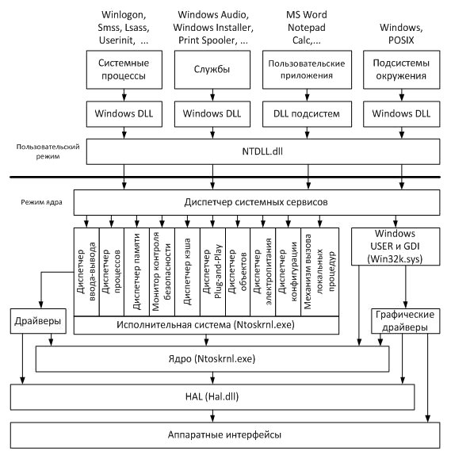
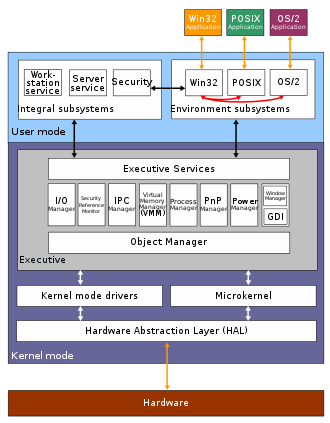
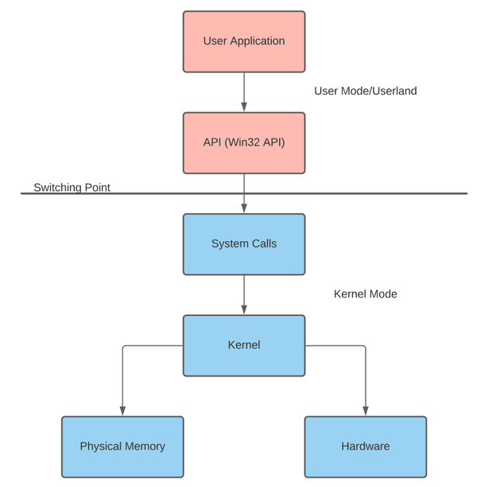

# Windows

**Wíndows** — это целая группа семейств коммерческих операционных систем корпорации `Microsoft`, ориентированных на управление с помощью графического интерфейса. Прародителем Windows является распространённая в 1980-х и 1990-х годах операционная система _MS-DOS_. Так, изначально Windows была всего лишь графической программой-надстройкой для MS-DOS.

Каждое семейство обслуживает определённый сектор компьютерной индустрии. Активные семейства Microsoft Windows включают `Windows NT` и `Windows IoT` и др. Давайте кратко остановимся на этих двух. 

**Windows NT** — семейство операционных систем, выпускаемых с середины 1993 года, которые первоначально позиционировались как системы для рабочих станций и серверов. ОС этого семейства в настоящее время работают на процессорах с архитектурами x86, x86-64, ARM. Все ОС являются полностью 32- или 64-битными и не нуждаются в MS-DOS даже для загрузки. Как уже говорилось, в этом семействе представлены операционные системы для серверов.

**Windows IoT (ранее Windows Embedded)** — семейство встраиваемых операционных систем Microsoft Windows, используемых в различных программно-технических комплексах: банкоматах, терминалах, медицинских приборах и т.д. Будучи основанными на настольных версиях **NT**, системы Embedded отличаются от первых модифицированным ядром, урезанным функционалом и более низкой стоимостью.

## Общая схема архитектуры

Windows на базе NT представляет собой операционную систему с гибридным ядром. **Гибридное ядро** – это тип ядра операционной системы, который *объединяет преимущества монолитного и микроядерного ядра*. 

**Идея гибридного ядра** состоит в том, чтобы иметь структуру ядра, аналогичную структуре микроядра, но реализовать эту структуру подобно монолитному ядру. В отличие от микроядра, все службы операционной системы в гибридном ядре по-прежнему находятся в пространстве ядра, в то время как все сервисы находятся в пользовательском пространстве. Как и в случае с обычным монолитным ядром, здесь отсутствуют накладные расходы на передачу сообщений и переключение контекста между ядром и пользовательским режимом, которые обычно поставляются с микроядром.

В Windows основные системные функции по управлению процессами, памятью, устройствами, файловой системой и безопасностью реализованы в компонентах, работающих в режиме ядра, однако существует ряд важных системных компонентов пользовательского режима, например, системные процессы входа в систему, локальной аутентификации, диспетчера сеансов, а также подсистемы окружения.

## Компоненты пользовательского режима

В пользовательском режиме работают следующие виды процессов (процесс в Windows — это экземпляр выполняемой программы):

- **Системные процессы (system processes)** – компоненты Windows, отвечающие за решение критически важных системных задач (т. е. аварийное завершение одного из этих процессов вызывает крах или нестабильную работу всей системы), но выполняемые в пользовательском режиме. Основные системные процессы:
  - `Winlogon.exe` – процесс входа в систему и выхода из неё;
  - `Smss.exe` (Session Manager – диспетчер сеансов) – процесс выполняет важные операции при инициализации системы (загрузка необходимых DLL, запуск процессов Winlogon и Csrss и др.), а затем контролирует работу Winlogon и Csrss;
  - `Lsass.exe` (Local Security Authentication Subsystem Server – сервер подсистемы локальной аутентификации) – процесс проверяет правильность введенных имени пользователя и пароля;
  - `Wininit.exe` – процесс инициализации системы (например, запускает процессы Lsass и Services);
  - `Userinit.exe` – процесс инициализации пользовательской среды (например, запускает системную оболочку – по умолчанию, Explorer.exe);
  - `Services.exe` (SCM, Service Control Manager – диспетчер управления службами) – процесс, отвечающий за выполнение служб;
- **Службы (сервисы, services)** – приложения, работающие в фоновом режиме и не требующие взаимодействия с пользователем. Службы могут быть как частью операционной системы (например, Windows Audio – служба для работы со звуком, или Print Spooler – диспетчер печати), так и частью пользовательского приложения (например, служба СУБД SQL Server). За службы отвечает системный процесс `Services.exe`;
- **Пользовательские приложения (user applications)** – прикладные программы, запускаемые пользователем;
- **Подсистемы окружения (environment subsystems)** – компоненты, предоставляющие доступ приложениям к некоторому подмножеству системных функций. Windows поддерживает 2 подсистемы окружения:
  - `Windows` – при помощи данной подсистемы выполняются 32 разрядные приложения Windows (Win32), а также 16 разрядные приложения Windows (Win16), приложения MS DOS и консольные приложения (Console). За подсистему Windows отвечает системный процесс Csrss.exe и драйвер режима ядра Win32k.sys;
  - `POSIX` (Portable Operating System Interface for UNIX – переносимый интерфейс операционных систем UNIX) – подсистема для UNIX-приложений. Начиная с Windows Server 2003 R2 компонент, реализующий эту подсистему, называется SUA (Subsystem for UNIX-based Applications). Компонент не устанавливается в Windows по умолчанию.

## Компоненты режима ядра

**Диспетчер системных сервисов** (System Service Dispatcher) работает в режиме ядра, перехватывает вызовы функций от Ntdll.dll, проверяет их параметры и вызывает соответствующие функции из Ntoskrnl.exe.

**Исполнительная система** и **ядро** содержатся в `Ntoskrnl.exe` (NT Operating System Kernel – ядро операционной системы NT) Исполнительная система (Executive) представляет собой совокупность компонентов (называемых *диспетчерами – manager*), которые реализуют основные задачи операционной системы:

- **Диспетчер процессов (process manager)** – управление процессами и потоками;
- **Диспетчер памяти (memory manager)** – управление виртуальной памятью и отображение её на физическую;
- **Монитор контроля безопасности (security reference monitor)** – управление безопасностью;
- **Диспетчер ввода вывода (I/O manager), диспетчер кэша (cache Manager), диспетчер Plug and Play (PnP Manager)** – управление внешними устройствами и файловыми системами;
- **Диспетчер электропитания (power manager)** – управление электропитанием и энергопотреблением;
- **Диспетчер объектов (object manager), диспетчер конфигурации (configuration manager), механизм вызова локальных процедур (local procedure call)** – управление служебными процедурами и структурами данных, которые необходимы остальным компонентам.

**Ядро (Kernel)** содержит функции, обеспечивающие поддержку компонентам исполнительной системы и осуществляющие планирование потоков, механизмы синхронизации, обработку прерываний.

*Компонент Windows USER и GDI* отвечает за пользовательский графический интерфейс (окна, элементы управления в окнах – меню, кнопки и т. п., рисование), является частью подсистемы Windows и реализован в драйвере Win32k.sys.

Взаимодействие диспетчера ввода вывода с устройствами **обеспечивают драйверы (drivers)** – программные модули, работающие в режиме ядра, обладающие максимально полной информацией о конкретном устройстве.

Однако, и драйверы, и ядро не взаимодействуют с физическими устройствами напрямую – посредником между программными компонентами режима ядра и аппаратурой является **HAL (Hardware Abstraction Layer)** – уровень абстрагирования от оборудования, реализованный в `Hal.dll`. HAL позволяет скрыть от всех программных компонентов особенности аппаратной платформы (например, различия между материнскими платами), на которой установлена операционная система.

## Что такое API?

**API** (*Application Programming Interface*, интерфейс прикладного программирования) служит программным интерфейсом для использования другими программами. API операционной системы является фундаментальной причиной несовместимости различных операционных систем. Поскольку Mac OS и Windows имеют совершенно разные API, программы, предназначенные для использования одного, не могут использовать другой. 

В высокоуровневом программировании программа часто не выполняет задачи сама, а вместо этого сообщает об этом какой-либо другой программе. В случае операционных систем программы часто делегируют различные задачи базовой ОС. Например, если программа желает записать данные на диск, она не отправляет вручную команды на сам жесткий диск для поиска, чтения, записи и т.д. Вместо этого программа просто сообщает ОС записать определенный объем данных в указанный файл, а всю работу выполняет непосредственно ОС. 

Преимущества такого устройства очевидны. Так, разработчикам программного обеспечения не нужно беспокоиться об основных рутинных операциях, связанных с каждой программой (таких как доступ к диску, выделение памяти, рисование на мониторе и т.д.), что экономит как время, так и конечный размер программы + обеспечивает универсальность. 

## Windows API

**Windows API (Windows Application Programming Interface, WinAPI)** – это способ взаимодействия процессов пользовательского режима с модулями режима ядра, который включает тысячи функций.  Windows API обрабатывает всё, что делает Windows такой, какая она есть. *Оно включает в себя такие вещи, как рисование на мониторе, доступ к диску, интерфейс принтера, использование Интернета и т.д.* Оно также предоставляет большинство функций, общих для всего программного обеспечения на базе Windows. Например, общие диалоговые окна, оболочка Windows, списки, настройки операционной системы и др. Программы на базе Windows используют Windows API практически в каждой задаче. 

Многие функции Windows API расположена в одном из файлов DLL (Dynamic Link Library), найденных в каталоге `C:\Windows\System`. Эти DLL-файлы "экспортируют" функции внутри себя – они позволяют внешним программам использовать их функции. Такой дизайн позволяет любой программе под управлением Windows относительно легко получить доступ к любой функции API. 

### Основные Windows DLL:

- **Kernel32.dll** – базовые функции, в том числе работа с процессами и потоками, управление памятью и вводом выводом;
- **Advapi32.dll** – функции, в основном связанные с управлением безопасностью и доступом к реестру;
- **User32.dll** – функции, отвечающие за управление окнами и их элементами в GUI приложениях (Graphical User Interface – графический интерфейс пользователя);
- **Gdi32.dll** – функции графического пользовательского интерфейса (Graphics Device Interface, GDI), обеспечивающие рисование на дисплее и принтере графических примитивов и вывод текста.

Библиотека **Ntdll.dll** экспортирует в большинстве своем недокументированные системные функции, реализованные, в основном, в `Ntoskrnl.exe`. Набор таких функций называется Native API ("родной" API). Библиотеки Windows DLL преобразуют вызовы документированных WinAPI функций в вызовы функций Native API и переключают процессор на режим ядра.

## Компоненты Windows API

- `Функции` – составляют ядро Windows API. Они представляют собой фактический код, который выполняет различные задачи, обрабатываемые API. Они хранятся в файлах DLL, и к ним можно легко получить доступ из любой программы под управлением Windows.
- `Структуры` – комбинации нескольких отдельных переменных, часто используются в Windows API для хранения групп связанной информации. Многие функции API требуют, чтобы им передавалась структура для более удобной передачи большого объема информации.
- `Именованные константы` – Windows API часто использует числовые коды для получения информации. Присвоение имен этим константам обеспечивает более удобный способ обращения к этим значениям в коде. Иногда эти константы используются в качестве флагов: значение данных может быть двоичным.
- `Функции обратного вызова` – концептуально является обратной функции API.
- `Сообщения` – представляют собой особый тип именованной константы. Хотя они также являются числовыми значениями, которым присвоены имена, они ведут себя по-разному. Сообщения отправляются, чтобы сообщить что-то сделать. 

*Каждая версия Microsoft Windows содержит версию Windows API, и почти каждая новая версия Microsoft Windows содержит дополнения и изменения в Windows API*. Когда существовала только одна версия, она называлась просто Windows API. Затем, когда было сделано первое крупное обновление, Microsoft присвоила ему имя Win32, а первой версии – Win16. 

- **Win16** находится в 16-разрядных версиях Windows. Функции находятся в основном в основных файлах операционной системы: `kernel.exe` (или krnl286.exe или krnl386.exe), `user.exe` и `gdi.exe`. Несмотря на расширение файла exe, доступ к такому файлу осуществляется как к динамической библиотеке.
- **Win32** присутствует в 32-разрядных версиях Windows (NT, 95 и более поздних). Функции реализованы в системных файлах DLL, включая `kernel32.dll`, `user32.dll` и `gdi32.dll`. Win32 был представлен с Windows NT. 
- **Win32s** – это расширение для семейства Windows 3.1x, которое реализовало подмножество Win32 API для этих систем. Буква "s" означает "подмножество".
- **Win64** – версия для `64-разрядных` платформ архитектуры Windows. Как 32-разрядные, так и 64-разрядные версии приложения могут быть скомпилированы из одной кодовой базы, хотя некоторые старые функции API устарели и были удалены. 

*Все перечисленные процессы пользовательского режима (кроме подсистемы POSIX) для взаимодействия с модулями режима ядра используют библиотеки Windows DLL (Dynamic Link Library – динамически подключаемая библиотека). Каждая DLL экспортирует набор Windows API функций, которые может вызывать процесс.*

Пример работы с функциями Windows API – **WindowsProject**.